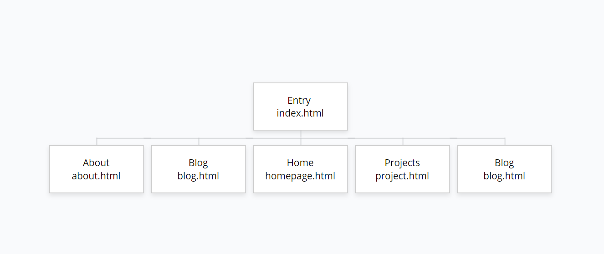

## Portfolio Website (T1A3)

### Github 

[https://github.com/MartinVald2170/Martinvald2170.github.io](https://github.com/MartinVald2170/Martinvald2170.github.io)

### Website

[http://martinvald2170.io](http://MartinVald2170.github.io)

## Purpose

To build an appealing and interactive website that can be used to easily find information about myself for anyone who checks it out

## Functionality and Features
#### An entry page that gives off a very good first impression
The first thing people will see is my face and an aesthetic hover effect which is clickable to enter the website. I wanted it to function as a big "This is me and this is my face" and show that I can use css effects to make things look cool.

#### Audio play Button on the Homepage 
A play music function that can play a preloaded song that can be used to set the mood of the website. This will give an impression to the user as to what kind of music I enjoy and gives an idea in their head what kind of person I am. 

#### Slideshow on homepage that needs to be activated 
A slideshow I can put images I want the user to see on my homepage only after being activated. I did not want to flood the user with things on the page so I left the middle quite clear until they want to activate it

#### Side Nav Bar 
To navigate the website I used the sidebar nav approach with a button on the top of the page that opens it up. I like menus that hide so the page feels less clustered 

####  Social Panel that is animated 
A social media panel linking to my twitter, youtube and github. If I am going to link my social media I am goign to do it in style. The buttons get activatd when you hover over them. I kept it only on the home page because I don't want to be pushy and I link my github on my projects page. 

#### Buttons 
Buttons that a big and do what they are labeled to do. Makes it easier for the user to do what they want to do eg downloading resume on about me page or go to git hub on my projects folder 

#### Tables
To organise information and the blog easier and makes it look more organised 

#### Contact Form 
On my contact page I have a contact form the user can fill out to send me a question

# Target Audience

My target audience is anyone interested in seeing a new developers journey and see what I can do. As my skills get better my website gets better. The more content and projects I create, more of it ends up on my portfolio website. A representation of my skills. 

### Color Choices

-----------------

## Sitemap 
Side Nav menu connects all the pages together except the entry page

#### Screenshots of Website 

-------

### Languages used (Techstack)

- HTML5
- CSS3
- Javascript (some for slideshow)
- Used WS school and adjusted through trial and error 

### Hosting 

- Github Pages

